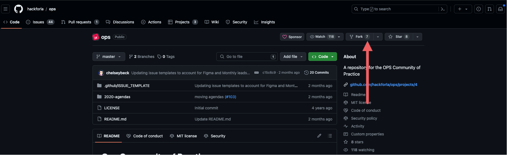
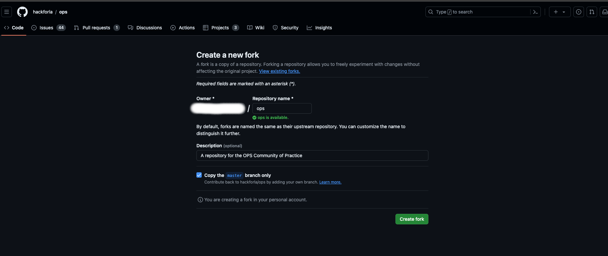

# **How to Contribute to Ops**

Thank you for taking the time to contribute!

The following guidelines are for contributing to the ops repository hosted on GitHub. These are intended as guidelines rather than strict rules. Please use your discretion, and don't hesitate to suggest changes to this document by submitting a pull request.

**This guide assumes that you have finished the onboarding process, which involves joining the Hack for LA Slack, GitHub, and Google Drive. If you haven't completed onboarding yet, please visit the [Getting Started Page](https://www.hackforla.org/getting-started).**

**The team recommends using [VS Code](https://code.visualstudio.com/download) as the preferred text editor for working on code, but feel free to utilize a text editor of your preference.**

**If you have any additional questions about your contribution process, please feel free to reach out to the team in the [#ops](https://hackforla.slack.com/archives/CV7QGL66B) Slack channel.**
<br><br>

## **Table of Contents**

- [**How to Contribute to Ops**](#how-to-contribute-to-ops)
  - [**Table of Contents**](#table-of-contents)
  - [**Setting up the local development environment**](#setting-up-the-local-development-environment)
  - [**Fork the repository**](#fork-the-repository)
  - [**Clone (Create) a copy on your computer**](#clone-create-a-copy-on-your-computer)
    - [Clone repo (1): Create `hackforla` folder\*\*](#clone-repo-1-create-hackforla-folder)
    - [Clone repo (2): Verify `origin` remote url\*\*](#clone-repo-2-verify-origin-remote-url)
    - [What if you accidentally cloned using the repository URL from the HackForLA Github (instead of the fork on your Github)?\*\*](#what-if-you-accidentally-cloned-using-the-repository-url-from-the-hackforla-github-instead-of-the-fork-on-your-github)
      - [**i. Resolve remote (1): reset `origin` remote url**](#i-resolve-remote-1-reset-origin-remote-url)
      - [**ii. Resolve remote (2): Add an `upstream` remote**](#ii-resolve-remote-2-add-an-upstream-remote)
  - [**Working on an issue**](#working-on-an-issue)
    - [**Working on an issue (1): Verify current branch is `master`**](#working-on-an-issue-1-verify-current-branch-is-master)
    - [**Working on an issue (2): Create a new branch where you will work on your issue**](#working-on-an-issue-2-create-a-new-branch-where-you-will-work-on-your-issue)
    - [Branch name convention](#branch-name-convention)
    - [**Working on an issue(3): Prepare your changes to push to your repository**](#working-on-an-issue3-prepare-your-changes-to-push-to-your-repository)
  - [**Making a pull request**](#making-a-pull-request)

## **Setting up the local development environment**

## **Fork the repository**

Fork the hackforla/ops repository by clicking <a href="https://github.com/hackforla/ops/fork"> <button>  Fork</button></a>
. A fork is a copy of the repository that will be placed on your GitHub account.

<details>
  <summary><strong>Click here</strong> to see a visual example of the `fork` button within the ops repo</summary>
  <p><strong>First, you find the `fork` button on the top right hand side of the [Hack for LA ops repo](https://github.com/hackforla/ops)</strong></h4>



 <p><strong>Next, you will be redirected to the create a fork page. [Hack for LA op repo](https://github.com/hackforla/ops/fork) Click on the Create fork button at the bottom<strong></p>
 

</details><br>

**Note:** It should create a URL that looks like the following -> `https://github.com/<your_GitHub_user_name>/ops`.

**For example** -> `https://github.com/octocat/ops`.

**Be Aware:** What you have created is a forked copy in a remote version on GitHub. It is not yet on your local machine yet.

<sub>[Back to Table of Contents](#table-of-contents)</sub>

### **Clone (Create) a copy on your computer**

Before creating a copy to your local machine, you must have Git installed. You can find instructions for installing Git for your operating system [**here**](https://git-scm.com/book/en/v2/Getting-Started-Installing-Git).

The following steps will clone (create) a local copy of the forked repository on your computer.

#### Clone repo (1): Create `hackforla` folder\*\*

Create a new folder on your computer that will contain `hackforla` projects.

Navigate to the location where you want to create a new folder for your `hackforla` projects using your command line interface(Terminal, Git Bash, Powershell). Create a new folder on your computer to hold these projects. Then, navigate into the newly created folder.

For example:

```bash
mkdir hackforla
cd hackforla
```

and run the following commands:

```bash
git clone https://github.com/<your_GitHub_user_name>/ops.git
```

For example if your GitHub username was `octocat`:

```bash
git clone https://github.com/octocat/ops.git
```

You should now have a new folder in your `hackforla` folder called `ops`. Verify this by changing into the new directory:

```bash
cd ops
```

#### Clone repo (2): Verify `origin` remote url\*\*

Verify that your local cloned repository is pointing to the correct `origin` URL (that is, the forked repo on your own Github account):

```bash
git remote -v
```

You should see `fetch` and `push` URLs with links to your forked repository under your account (i.e. `https://github.com/<your_GitHub_user_name>/ops.git`). You are all set to make working changes to the website on your local machine.

However, we still need a way to keep our local repo up to date with the original repository. To do so, you must add an upstream remote to incorporate changes made while you are working on your local repo. Run the following to add an upstream remote URL & update your local repo with recent changes to the `origin master` branch:

```bash
git remote add upstream https://github.com/hackforla/ops.git
git fetch upstream
```

After adding the upstream remote, you should now see it if you again run `git remote -v` :

```bash
origin  https://github.com/<your_GitHub_user_name>/ops.git (fetch)
origin  https://github.com/<your_GitHub_user_name>/ops.git (push)
upstream        https://github.com/hackforla/ops.git (fetch)
upstream        https://github.com/hackforla/ops.git (push)
```

#### What if you accidentally cloned using the repository URL from the HackForLA Github (instead of the fork on your Github)?\*\*

##### **i. Resolve remote (1): reset `origin` remote url**

Set your forked repo on your Github as an `origin` remote:

```bash
git remote set-url origin https://github.com/<your_GitHub_user_name>/ops.git
```

For example if your GitHub username was `octocat`:

```bash
git remote set-url origin https://github.com/octocat/ops.git
```

##### **ii. Resolve remote (2): Add an `upstream` remote**

Add a new remote named `upstream` that points to the `hackforla` repository version. This step will enable you to integrate changes from that repository later on.

```bash
git remote add upstream https://github.com/hackforla/ops.git
```

<sub>[Back to Table of Contents](#table-of-contents)</sub>

### **Working on an issue**

For each issue you address, create a new branch. Working on topic branches ensures that your main branch(named `master`)remains untouched and makes it easier to synchronize your fork with the main project.

#### **Working on an issue (1): Verify current branch is `master`**

first make sure you are on the master branch.

```bash
git checkout master
```

Update your master branch with the latest changes

```
git pull upstream master
```

<sub>[Back to Table of Contents](#table-of-contents)</sub>

#### **Working on an issue (2): Create a new branch where you will work on your issue**

Using `git checkout -b` command to create a new branch and immediately switch into it.

#### Branch name convention

Choose a branch name that:

- relates to the issue (No spaces!)
- includes the issue number

For example, if you create a new issue branch for [Add a CONTRIBUTING.md to the Ops repo #120](https://github.com/hackforla/ops/issues/120):

```bash
git checkout -b add-contributing-md-120
```

Here `add-contributing-md-120` is your branch name

**Note:** The format should resemble the scheme above, with words that briefly describe the issue in a way that is understandable at a glance to someone unfamiliar with the problem. The issue number should be included at the end.

**Note:** Git uses spaces as delimiters in various commands, so branch names cannot contain spaces.

#### **Working on an issue(3): Prepare your changes to push to your repository**

##### **i. Prepare repo changes (1): Use the `git add` command to stage your changes.**

This command prepares your changes for the next commit. You can stage files individually by specifying their filenames.

Run this command if you want to **add changes from a specific file(s) to your commit record**:

```bash
git add “filename.ext”
```

Run this command if you want to **add all changes to all file(s) to your commit record**:

```bash
git add .
```

##### **ii. Prepare repos changes (2): Use the `git status` command to see what files are staged.**

This command display a list of files that have been staged for the next commit. These files will be included in the commit when you run `git commit`. Ensure that all staged changes are relevant to the current task if you accidentally staged unrelated changes, you can unstage them before committing by following the instructions provided in the output of your `git status` command.

```bash
git status
```

##### **iii. Prepare repos changes (3): Use the `git commit` command**

This command saves your changes and prepares them for pushing to your repository. You can use the `-m` flag to add a message to your commit. The message should be a brief description of the issue you are addressing. It is important to make the message clear and understandable to others who may read it. Avoid being overly cryptic in your message.

To commit your changes with a message, run:

```bash
git commit -m “your commit message”
```

#### **Working on an issue(4): Pulling from upstream before you push**

**IMPORTANT:** Before you push your local commits to your repository, sync your fork with the `master` branch of the `origin` remote repository. Use `git pull upstream` to ensure your local repository is up-to-date with the `master` branch of the `origin` remote repository.

```bash
git pull upstream
```

After committing your changes locally, you can use below commands to push your committed changes to a remote repository, making them accessible to others working on the same projects.

```bash
git push --set-upstream add-contributing-md-120
```

<sub>[Back to Table of Contents](#table-of-contents)</sub>

### **Making a pull request**

##### **i. Complete pull request (1): Update pull request title**

The default title will be the same as your last commit message from your branch. Please modify it to summarize your changes.

```
Add contributing markdown file to repo
```

##### **ii. Complete pull request (3): Explain the changes you made, then explain why these changes were needed**

In textarea, explain the changes you made in order to complete the action items within your issue and why.

<sub>[Back to Table of Contents](#table-of-contents)</sub>
